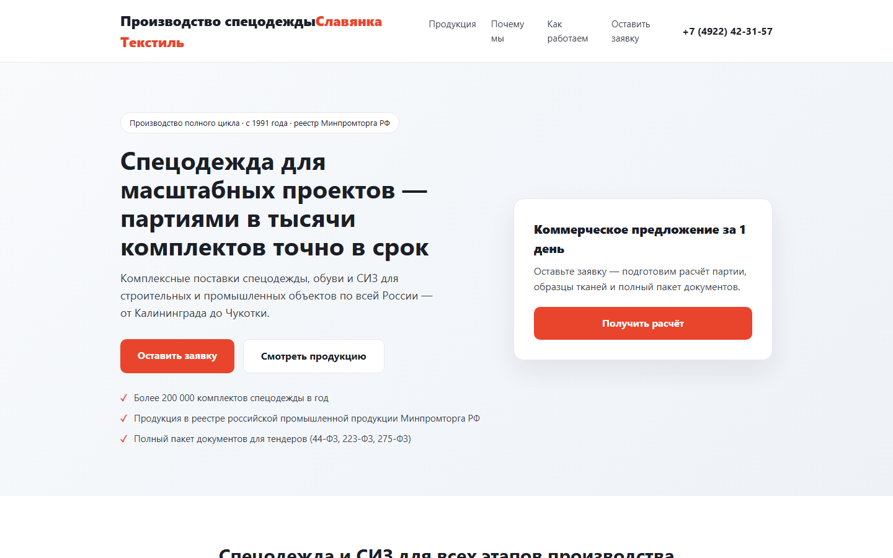

# MVP «Лендинг + заявки в Telegram»



*Полная страница: [images/screenshot-landing-full.png](images/screenshot-landing-full.png)*

Демо-лендинг для малого бизнеса (пример: производитель спецодежды
ООО «Славянка Текстиль», г. Владимир) с формой заявки и уведомлением в Telegram.
Является первым шагом 30-дневного плана развития собственного продукта (SaaS):
«конструктор мини-лендингов с заявками в Telegram».

## Проблема

Малому бизнесу нужен простой способ принимать заявки с сайта: конструкторы
дороги и избыточны, а без формы теряются до 70% потенциальных обращений.
Решение — готовый мини-лендинг, который отправляет заявку сразу в Telegram,
где владелец бизнеса и так находится весь день.

## Пользователи

- **Малый бизнес** (швейные цеха, мастерские, услуги) — приём заявок без программиста
- **Фрилансеры и веб-студии** — быстрый запуск лендингов для клиентов
- **Маркетологи** — тестирование гипотез и приём лидов

## Стек
- Frontend: HTML, CSS, vanilla JS (статичный лендинг)
- Backend: Node.js + Express
- Уведомления: Telegram Bot API
- Деплой: Railway / Render / любой Node-хостинг

## Запуск локально

```bash
npm install
Copy-Item .env.example .env   # Windows PowerShell
# заполните .env: TELEGRAM_BOT_TOKEN и TELEGRAM_CHAT_ID
npm start
```

Откройте http://localhost:3000

## Как настроить Telegram
1. В Telegram напишите @BotFather → `/newbot` → получите токен.
2. Напишите своему боту любое сообщение.
3. Узнайте chat_id: напишите @userinfobot.
4. Впишите значения в `.env`.

## Деплой (Railway)
1. Создайте новый проект и подключите репозиторий.
2. Укажите переменные окружения `TELEGRAM_BOT_TOKEN` и `TELEGRAM_CHAT_ID`.
3. Start command: `npm start`.

## Проверка формы без Telegram
Если токен не заполнен, заявка не отправляется в Telegram, но сервер пишет
заявку в консоль и возвращает `{ ok: true }` — это удобно для теста.